<!--
generated from agentide v1
model digest 25e9166b8868f241427b472490b597717a3427148acd02a5708f3387524c60af
contract digest 900cb83bde9c01e7f6714965c40a0183dfbf0be51165107e84a58bd242d42115
do not edit: regenerate with `ess generate`
-->

# agentide v1

A coding-session interface in which agents invoke stable semantic intents while deployments bind those intents to guarded implementations and humans observe the same durable event projection.

## The system as a graph

```mermaid
flowchart TB
    subgraph who["who may ask"]
        who0["agentide.coding.CodingAgent"]
        who1["agentide.session.CodingAgent"]
        who2["agentide.session.Operator"]
        who3["agentide.surface.CodingAgent"]
    end
    subgraph unit0["agentide-engine"]
        cmd0["agentide.coding.ApplyDeployment"]
        cmd1["agentide.coding.CancelProcess"]
        cmd2["agentide.coding.CreateWorktree"]
        cmd3["agentide.coding.CutRelease"]
        cmd4["agentide.coding.DelegateAgent"]
        cmd5["agentide.coding.EditCode"]
        cmd6["agentide.coding.FinishWorktree"]
        cmd7["agentide.coding.InputProcess"]
        cmd8["agentide.coding.MessageAgent"]
        cmd9["agentide.coding.ObserveAgents"]
        cmd10["agentide.coding.ObserveChanges"]
        cmd11["agentide.coding.ObserveDeployment"]
        cmd12["agentide.coding.ObserveProcess"]
        cmd13["agentide.coding.ObserveWorktree"]
        cmd14["agentide.coding.PublishCode"]
        cmd15["agentide.coding.ReadCode"]
        cmd16["agentide.coding.RecordEvidence"]
        cmd17["agentide.coding.SearchCode"]
        cmd18["agentide.coding.StartProcess"]
        cmd19["agentide.coding.VerifyCode"]
        cmd20["agentide.coding.WaitAgent"]
        cmd21["agentide.coding.WaitProcess"]
        cmd22["agentide.session.CloseSession"]
        cmd23["agentide.session.ReadEvents"]
        cmd24["agentide.session.SnapshotSession"]
        cmd25["agentide.session.StartSession"]
        cmd26["agentide.surface.CloseFile"]
        cmd27["agentide.surface.ClosePane"]
        cmd28["agentide.surface.FocusPane"]
        cmd29["agentide.surface.MoveCursor"]
        cmd30["agentide.surface.OpenFile"]
        cmd31["agentide.surface.OpenPane"]
        cmd32["agentide.surface.ShowDiff"]
        cmd33["agentide.surface.SnapshotSurface"]
        evt0["agentide.coding.IntentCompleted"]
        evt1["agentide.coding.IntentRefused"]
        evt2["agentide.session.SessionClosed"]
        evt3["agentide.session.SessionObserved"]
        evt4["agentide.session.SessionStarted"]
        evt5["agentide.surface.CursorMoved"]
        evt6["agentide.surface.DiffShown"]
        evt7["agentide.surface.FileClosed"]
        evt8["agentide.surface.FileOpened"]
        evt9["agentide.surface.PaneClosed"]
        evt10["agentide.surface.PaneFocused"]
        evt11["agentide.surface.PaneOpened"]
        evt12["agentide.surface.SurfaceObserved"]
    end
    who0 -->|"may invoke"| cmd0
    who0 -->|"may invoke"| cmd1
    who0 -->|"may invoke"| cmd2
    who0 -->|"may invoke"| cmd3
    who0 -->|"may invoke"| cmd4
    who0 -->|"may invoke"| cmd5
    who0 -->|"may invoke"| cmd6
    who0 -->|"may invoke"| cmd7
    who0 -->|"may invoke"| cmd8
    who0 -->|"may invoke"| cmd9
    who0 -->|"may invoke"| cmd10
    who0 -->|"may invoke"| cmd11
    who0 -->|"may invoke"| cmd12
    who0 -->|"may invoke"| cmd13
    who0 -->|"may invoke"| cmd14
    who0 -->|"may invoke"| cmd15
    who0 -->|"may invoke"| cmd16
    who0 -->|"may invoke"| cmd17
    who0 -->|"may invoke"| cmd18
    who0 -->|"may invoke"| cmd19
    who0 -->|"may invoke"| cmd20
    who0 -->|"may invoke"| cmd21
    who1 -->|"may invoke"| cmd23
    who1 -->|"may invoke"| cmd24
    who2 -->|"may invoke"| cmd22
    who2 -->|"may invoke"| cmd25
    who3 -->|"may invoke"| cmd26
    who3 -->|"may invoke"| cmd27
    who3 -->|"may invoke"| cmd28
    who3 -->|"may invoke"| cmd29
    who3 -->|"may invoke"| cmd30
    who3 -->|"may invoke"| cmd31
    who3 -->|"may invoke"| cmd32
    who3 -->|"may invoke"| cmd33
    cmd0 -->|"completed"| evt0
    cmd1 -->|"completed"| evt0
    cmd2 -->|"completed"| evt0
    cmd3 -->|"completed"| evt0
    cmd4 -->|"completed"| evt0
    cmd5 -->|"completed"| evt0
    cmd6 -->|"completed"| evt0
    cmd7 -->|"completed"| evt0
    cmd8 -->|"completed"| evt0
    cmd9 -->|"completed"| evt0
    cmd10 -->|"completed"| evt0
    cmd11 -->|"completed"| evt0
    cmd12 -->|"completed"| evt0
    cmd13 -->|"completed"| evt0
    cmd14 -->|"completed"| evt0
    cmd15 -->|"completed"| evt0
    cmd16 -->|"completed"| evt0
    cmd17 -->|"completed"| evt0
    cmd18 -->|"completed"| evt0
    cmd19 -->|"completed"| evt0
    cmd20 -->|"completed"| evt0
    cmd21 -->|"completed"| evt0
    cmd22 -->|"closed"| evt2
    cmd23 -->|"observed"| evt3
    cmd24 -->|"observed"| evt3
    cmd25 -->|"started"| evt4
    cmd26 -->|"completed"| evt12
    cmd27 -->|"completed"| evt12
    cmd28 -->|"completed"| evt12
    cmd29 -->|"completed"| evt12
    cmd30 -->|"completed"| evt12
    cmd31 -->|"completed"| evt12
    cmd32 -->|"completed"| evt12
    cmd33 -->|"completed"| evt12
```

A command is accepted by the component that owns its context, emits the events one of its outcomes declares, and a dashed edge is a binding carrying an event into the next command. Design §9 begins one step earlier, at the actor who invokes the first command, and so does this graph: a solid edge out of an actor is a grant, and an actor drawn with no edge at all may invoke nothing — which is something the model says, not an arrow somebody forgot.

## Bounded contexts

- **[Coding session](domains/agentide.coding.md)** (`agentide.coding`) — Semantic observation, change, execution, collaboration, evidence, and delivery intents. Nine types, no entities, no views, 22 commands, two events, one error and one actor.
- **[Sessions](domains/agentide.session.md)** (`agentide.session`) — The durable identity and observable projection of one coding session. Five types, one entity, one view, four commands, three events, two errors and two actors.
- **[Workspace surface](domains/agentide.surface.md)** (`agentide.surface`) — A renderer-neutral virtual workbench shared by agents, the browser, CLI snapshots, and the console TUI. Four types, one entity, one view, eight commands, eight events, one error and one actor.

## Components

A component is a unit of ownership, not a deployment. How many of each runs, and what each needs, is [the topology](topology.md).

**`agentide-engine`** — Validates intents, plans effects, obtains authority, journals, dispatches, and projects sessions. It owns [`agentide.coding`](domains/agentide.coding.md), [`agentide.session`](domains/agentide.session.md) and [`agentide.surface`](domains/agentide.surface.md). It accepts `agentide.coding.ApplyDeployment`, `agentide.coding.CancelProcess`, `agentide.coding.CreateWorktree`, `agentide.coding.CutRelease`, `agentide.coding.DelegateAgent`, `agentide.coding.EditCode`, `agentide.coding.FinishWorktree`, `agentide.coding.InputProcess`, `agentide.coding.MessageAgent`, `agentide.coding.ObserveAgents`, `agentide.coding.ObserveChanges`, `agentide.coding.ObserveDeployment`, `agentide.coding.ObserveProcess`, `agentide.coding.ObserveWorktree`, `agentide.coding.PublishCode`, `agentide.coding.ReadCode`, `agentide.coding.RecordEvidence`, `agentide.coding.SearchCode`, `agentide.coding.StartProcess`, `agentide.coding.VerifyCode`, `agentide.coding.WaitAgent`, `agentide.coding.WaitProcess`, `agentide.session.CloseSession`, `agentide.session.ReadEvents`, `agentide.session.SnapshotSession`, `agentide.session.StartSession`, `agentide.surface.CloseFile`, `agentide.surface.ClosePane`, `agentide.surface.FocusPane`, `agentide.surface.MoveCursor`, `agentide.surface.OpenFile`, `agentide.surface.OpenPane`, `agentide.surface.ShowDiff` and `agentide.surface.SnapshotSurface`. It publishes `agentide.coding.IntentCompleted`, `agentide.coding.IntentRefused`, `agentide.session.SessionClosed`, `agentide.session.SessionObserved`, `agentide.session.SessionStarted`, `agentide.surface.CursorMoved`, `agentide.surface.DiffShown`, `agentide.surface.FileClosed`, `agentide.surface.FileOpened`, `agentide.surface.PaneClosed`, `agentide.surface.PaneFocused`, `agentide.surface.PaneOpened` and `agentide.surface.SurfaceObserved`.

## The other pages

| page | what is on it |
|---|---|
| [Coding session](domains/agentide.coding.md) | the `agentide.coding` vocabulary: its types, entities, views, commands, events, errors and actors |
| [Sessions](domains/agentide.session.md) | the `agentide.session` vocabulary: its types, entities, views, commands, events, errors and actors |
| [Workspace surface](domains/agentide.surface.md) | the `agentide.surface` vocabulary: its types, entities, views, commands, events, errors and actors |
| [Interactions](interactions.md) | every binding, with what it guarantees and what happens when it fails |
| [Type crossings](crossings.md) | every conversion this system permits, and the reason someone gave for it |
| [Topology](topology.md) | what each component needs in order to run |

---

Generated from agentide v1 · model digest `25e9166b8868f241427b472490b597717a3427148acd02a5708f3387524c60af` · contract digest `900cb83bde9c01e7f6714965c40a0183dfbf0be51165107e84a58bd242d42115`. Do not edit this file; change the specification and regenerate it with `ess generate`.
